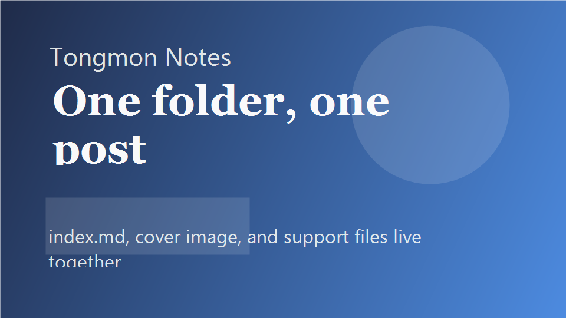

# Test header

Test header one.

## Why folder-owned content works

I wanted the content model to stay obvious even after the blog grows past a handful of posts. One folder per post keeps ownership simple:

- the markdown file lives next to its cover image
- supporting screenshots stay local to the article
- deleting or moving a post becomes one filesystem operation

### One folder, one post

The generator only needs to care about `content/posts/<slug>/index.md` and everything next to it. That keeps the mental model calm.


## What the build script produces

| Output               | Why it exists                    |
| -------------------- | -------------------------------- |
| Typed manifest       | Fast post list rendering         |
| Copied public assets | GitHub Pages-safe image delivery |
| Reading time         | Better archive scanning          |
| Draft filtering      | Cleaner production output        |

## The authoring checklist

- [x] Validate frontmatter
- [x] Sort by `publishedAt` descending
- [x] Keep slug ownership at the folder level
- [x] Copy post assets into public output
- [ ] Add more long-form essays

## A small implementation detail

```ts
const publicPath = path.posix.join("content", "posts", slug, "index.md");

export const record = {
  slug,
  readingTime: estimateReadingTime(content),
  contentPath: publicPath,
};
```

The app does not guess where markdown lives at runtime. The generated manifest already tells it what exists.[^manifest]

## Closing thought

This setup stays small on purpose. There is no CMS, no database, and no server process between the markdown file and the final page.

[^manifest]: That keeps routing and content lookup deterministic, especially on static hosting.
