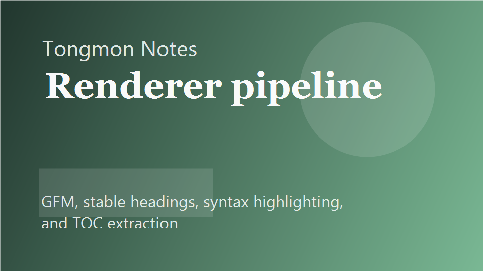

## Start with the renderer, not the CSS

The core stack here is intentionally narrow:

1. `react-markdown` for rendering
2. `remark-gfm` for common GitHub-flavored markdown behavior
3. `rehype-slug` and heading autolinks for stable anchors
4. syntax highlighting for fenced code blocks

### Keep HTML conservative

Raw HTML is easy to enable and easy to regret. For a personal blog like this one, it is better to keep the renderer conservative unless there is a strong reason to widen the surface area.

## Stateful UX without forcing global state everywhere

Zustand is only used for post list preferences, not for static content.

| Store field   | Reason                          |
| ------------- | ------------------------------- |
| `searchQuery` | Persistent archive search       |
| `selectedTag` | Keep filter context             |
| `viewMode`    | Remember preferred list density |



## Example code block

```tsx
const usePostFiltersStore = create<PostFiltersState>()(
  persist(
    (set) => ({
      viewMode: "grid",
      setViewMode: (value) => set({ viewMode: value }),
    }),
    { name: "tongmon-post-filters" },
  ),
);
```

## Notes for future posts

- [x] Tables render with clear borders
- [x] Task lists keep GitHub-style semantics
- [x] Images resolve from the post folder
- [x] Heading ids remain stable for the table of contents

## Final note

Good markdown rendering feels invisible. The reader should notice the writing first and the implementation only when something goes wrong.
